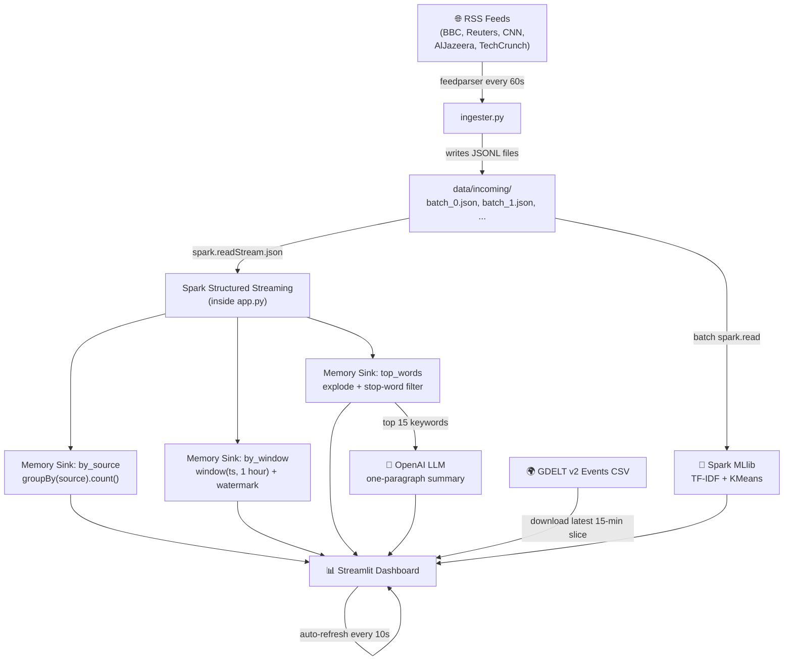

# 📰 News Pulse — Full Pipeline Walkthrough

## Architecture Diagram



---

## Step-by-Step Explanation

### Step 1 — Ingester ([ingester.py](file:///Users/96A/GitHub/winners-Pulse/ingester.py))

**What it does:** Pulls live news headlines from 5 RSS feeds every 60 seconds.

**How it works:**
1. Loops forever (`while True`)
2. On each tick, iterates through 5 RSS feed URLs
3. Uses `feedparser.parse(url)` to download and parse each feed
4. For each article entry, extracts 4 fields:
   - `source` — which feed (e.g. "BBC")
   - `title` — the headline text
   - `url` — link to the full article
   - `ts` — timestamp (from the feed's `published_parsed`, or `now()` as fallback)
5. Wraps each feed in `try/except` so a dead/slow feed never crashes the ingester
6. Writes all records as a **JSON-Lines** file (`batch_0.json`, `batch_1.json`, ...) into `data/incoming/`
7. Sleeps 60 seconds, then repeats

**Key design choice:** One file per tick (not one file per record). This means Spark sees each file as one micro-batch.

---

### Step 2 — Spark Structured Streaming (inside [app.py](file:///Users/96A/GitHub/winners-Pulse/app.py))

**What it does:** Watches the `data/incoming/` folder for new JSON files and maintains 3 live aggregation tables.

**How it works:**
1. `spark.readStream.schema(schema).json("data/incoming")` — Spark treats this folder like a stream. Every time a new `.json` file appears, Spark processes it as a new micro-batch.
2. Three parallel streaming queries run continuously in background threads:

| Query | Sink Name | Logic | Output Mode |
|-------|-----------|-------|-------------|
| Q1 | `by_source` | `groupBy("source").count()` | `complete` — full table on every update |
| Q2 | `by_window` | `withWatermark("ts","2 hours").groupBy(window("ts","1 hour")).count()` | `complete` — hourly buckets |
| Q3 | `top_words` | `regexp_extract_all` → `explode` → filter stop words → `groupBy("word").count()` | `complete` — running word counts |

3. All three write to **memory sinks** — in-memory tables inside the Spark JVM that you query with `spark.sql("SELECT * FROM by_source")`.

> [!IMPORTANT]
> The streaming queries run **inside `app.py`** (not in a separate process). This is critical because memory sinks only exist in the JVM that created them. If streaming ran in a separate terminal, the dashboard would never see the data.

**Watermark explained:** `withWatermark("ts", "2 hours")` tells Spark: "data arriving more than 2 hours late can be dropped." This lets Spark prune old state and prevents unbounded memory growth on the windowed query.

---

### Step 3 — LLM Summary ([llm_summary.py](file:///Users/96A/GitHub/winners-Pulse/llm_summary.py))

**What it does:** Takes the top 15 keywords from the `top_words` sink and asks OpenAI to write a one-paragraph news summary.

**How it works:**
1. Receives a list of keywords from the dashboard
2. Builds a prompt: *"Write ONE paragraph, ≤80 words, mention ≥3 named storylines"*
3. Calls the OpenAI chat completions API (`gpt-4o-mini`)
4. **Defensive fallback:** If the API key is missing or the call fails, it returns a keyword-only summary instead of crashing

**Why this matters:** The prompt is engineered to produce grounded, concise output. The fallback ensures the dashboard always renders something.

---

### Step 4 — Dashboard ([app.py](file:///Users/96A/GitHub/winners-Pulse/app.py))

**What it does:** A single Streamlit page that visualises all the streaming data.

**Components displayed:**

| # | Component | Data Source | Chart Type |
|---|-----------|-------------|------------|
| 1 | Headlines per Source | `by_source` memory sink | Bar chart |
| 2 | Volume per Hour | `by_window` memory sink | Line chart |
| 3 | Top 10 Keywords | `top_words` memory sink | Table |
| 4 | AI News Summary | LLM (OpenAI) | Text box |
| 5 | GDELT Global Events | GDELT v2 CSV download | Bar chart + table |
| 6 | Topic Clusters | Spark MLlib (TF-IDF + KMeans) | Expandable groups |
| 7 | Reflection (T5) | Static text | Expander |

**Auto-refresh:** The script sleeps 10 seconds then calls `st.rerun()`, making Streamlit re-execute the entire script — which re-queries all memory sinks and shows fresh data.

---

### Bonus 1 — GDELT Slice ([gdelt_loader.py](file:///Users/96A/GitHub/winners-Pulse/gdelt_loader.py))

**What it does:** Downloads the latest 15-minute GDELT v2 events CSV from `data.gdeltproject.org` and joins it with RSS headlines.

**How it works:**
1. Fetches `lastupdate.txt` from GDELT to find the URL of the latest events export
2. Downloads the `.zip`, extracts the `.CSV` in memory
3. Parses the 61-column tab-separated file into a Pandas DataFrame
4. **Country summary:** Aggregates event counts by country code → displayed as a bar chart
5. **RSS join:** Extracts actor names and location names from GDELT events, then scans RSS headlines for matches → displayed as a table showing which headlines overlap with global events

---

### Bonus 2 — Topic Clustering (inside [app.py](file:///Users/96A/GitHub/winners-Pulse/app.py))

**What it does:** Clusters all accumulated headlines into 3 topics using Spark MLlib.

**How it works (ML pipeline):**
1. **Batch read:** `spark.read.json("data/incoming")` — reads ALL accumulated headlines (not streaming)
2. **Tokenizer:** Splits each headline into a list of words
3. **StopWordsRemover:** Removes common English stop words
4. **HashingTF:** Converts word lists into fixed-size term-frequency vectors (256 features)
5. **IDF:** Applies Inverse Document Frequency weighting — rare words get higher scores
6. **KMeans (k=3):** Groups headlines into 3 clusters based on their TF-IDF vectors
7. Each headline gets a `topic` label (0, 1, or 2) and is displayed in expandable groups

---

## How to Run

Open **two** terminals (not three — streaming now runs inside `app.py`):

```bash
# Terminal 1 — Ingester (pulls RSS every 60s)
python ingester.py

# Terminal 2 — Dashboard + Streaming + Everything
streamlit run app.py
```

> [!TIP]
> Set `export OPENAI_API_KEY=sk-...` before running Terminal 2 if you want LLM summaries. Without it, the dashboard still works but shows a keyword-only fallback.

---

## Data Flow Summary

```
RSS Feeds (live internet)
    │
    ▼
ingester.py  ──writes──▶  data/incoming/batch_N.json   (JSONL files, one per tick)
                                  │
                    ┌─────────────┼─────────────────┐
                    ▼             ▼                  ▼
              readStream     readStream          readStream
                    │             │                  │
              by_source      by_window          top_words
            (memory sink)  (memory sink)      (memory sink)
                    │             │                  │
                    └─────────────┼──────────────────┘
                                  │
                           spark.sql(...)
                                  │
                                  ▼
                         Streamlit Dashboard
                        ┌─────────────────────┐
                        │  Bar chart (sources) │
                        │  Line chart (hourly) │
                        │  Keywords table      │
                        │  LLM summary         │
                        │  GDELT events        │
                        │  Topic clusters      │
                        └─────────────────────┘
                                  │
                           auto-refresh 10s
```
